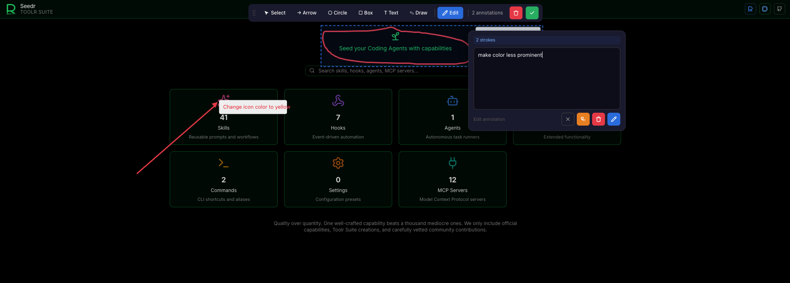
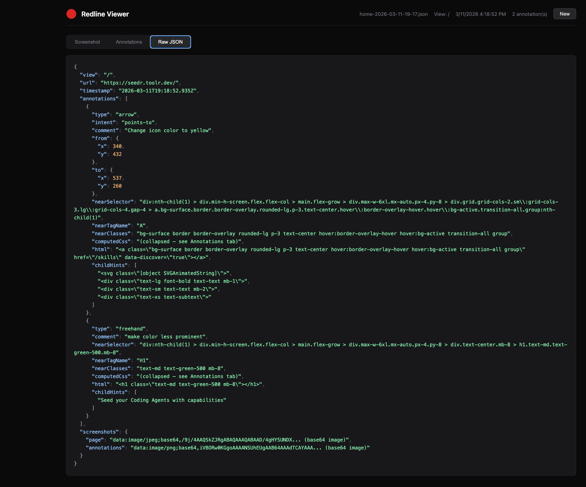

# Redline — UI Annotation Chrome Extension

Annotate UI elements directly in any web app running in Chrome. Produces structured JSON annotation files designed for consumption by AI coding agents like Claude Code.





## Features

- **Select** elements to annotate with comments
- **Draw** arrows, circles, boxes, freehand, and text annotations
- **Edit** existing annotations
- **Session persistence** — resume interrupted sessions
- **Pixel-perfect screenshots** via `captureVisibleTab`
- **Structured JSON output** with selectors, computed CSS, and element metadata
- **Viewer** — built-in annotation file viewer with screenshot compositing

## Installation

### From Source (Developer Mode)

1. Clone this repository
2. Open `chrome://extensions/`
3. Enable **Developer mode** (top right)
4. Click **Load unpacked** and select the repository directory
5. Pin the extension icon for quick access

## Usage

1. **Start**: Click the Redline toolbar icon or press `Cmd+Option+Shift+A` (Mac) / `Ctrl+Alt+Shift+A` (Win/Linux)
2. **Name the session** when prompted
3. **Annotate**: Select elements, draw shapes, add comments
4. **Finish**: Press the shortcut again — the annotation file downloads automatically and the filename is copied to your clipboard
5. **View**: Press `Alt+Shift+V` to open the built-in annotation viewer, or use `/redline <filename>` in Claude Code

## Integration with AI Coding Agents

The annotation file contains structured data (selectors, computed CSS, element HTML, screenshots) ready for AI consumption. Install the [Redline skill](https://seedr.toolr.dev/skills/redline) to enable the `/redline` slash command in Claude Code:

```bash
npx @toolr/seedr add redline --type skill
```

Then pass the downloaded annotation file to your coding agent:

```
/redline home-2026-03-11-14-30.json
```

## Keyboard Shortcuts

| Shortcut | Action |
|----------|--------|
| `Cmd+Option+Shift+A` / `Ctrl+Alt+Shift+A` | Toggle annotation overlay |
| `Alt+Shift+V` | Open annotation viewer |
| `Escape` | Cancel current selection/drawing |

## Requirements

- Chrome 102+
- Permissions: `activeTab`, `scripting`

## License

MIT
